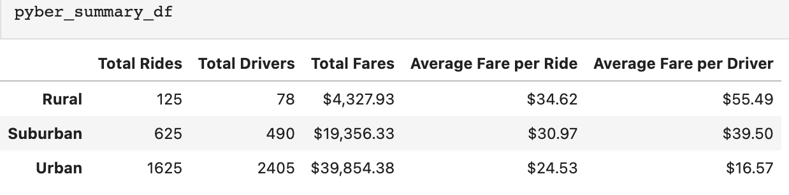

# PyBer Ride Sharing Data Analysis
## Overview of the Analysis
The purpose of this analysis is to reveal ride-sharing data by city type and determine total weekly fares for each city type. This analysis will be used to establish how the data differs by city type and how those differences can be used by decision-makers at PyBer.
## Results 
Using the ridesharing data provided, an analysis was done on the differences in the data by the three city types, which are rural, suburban and urban. Ride-sharing data includes the total rides, total drivers, total fares, average fare per ride and driver, and total fare by city type. 
When comparing the differences in ride sharing data among the different city types, there is an obvious pattern. The rural city type has the least amount of total drivers and total fares, while the urban city type has most amount of drivers and therefore total fares and the suburban city time is in between. The average fare per ride and average fare per driver is the most expensive for the rural city type and the least for urban city type, with the suburban city type in between. The summary dataframe seen below reflects these results. 

The same data was used to determine the total amount of fares earned per week by city type for the first four months of the year. The pandas pivot method and resample method were used. As expected, the total fares earned were the lowest for the rural city area, the suburban city area was in the middle and the urban city area earn the most. The multi-line graph that shows the total fares for each week by city type reflects this result.

## Summary: 
Based on the results of the analysis, here are three business recommendations to the CEO to address some of the disparities among the city types.
1.	Have more drivers available in the rural city area – currently there are only 78 drivers in the rural city area, having more drivers available in the area will lower the cost per ride and may entice more people to use the service in the rural city area.
2.	Charge less per ride in the rural city area – currently the average fare per a ride in the rural city area is $34, this may be cost prohibitive for potential users of PyBer. Charging less per ride may entice more people to use the service. 
3.	Charge more per ride in the urban city area during high demand – there is clearly high demand for rides in the urban city area, therefore PyBer could start charging more for rides during high demand times like holidays or weekends.
